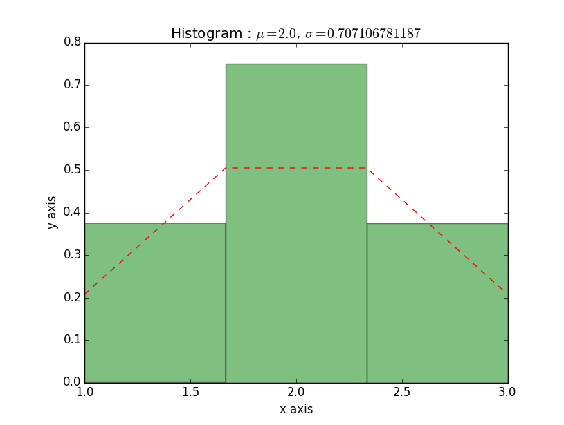

# matplot-opencv
This library offers the data of **OpenCV**'s `cv::Mat` a quick review as showing line, histogram, 1D curve, or 2D curve for algorithm development, **with just simple few lines of code**. Also, this library takes the advantage of the most popular **matplotlib** as the core of drawing, and enjoys its beautiful displays.  

System requirements:
--------------------
 * Python > 3.0
 * OpenCV > 2.0
 * numpy
 * matplotlib

Usage:
------
 1. Install this library with:  
    `python setup.py install`
 2. Involve the resources in `/include` into your project. 

ps. Currently only Visual Studio 2010 with python 3.4 is tested. 

Sample code:
------------
Three functions are shown below:

 * Draw a 2D filter
~~~.cpp
#include <opencv2/imgproc/imgproc.hpp>
#include <matplot-opencv.hpp>
using namespace cv;
namespace plt = matplotcv;
void main(){
    Mat	mat = (Mat_<float>(3,3)<<1,2,1,2,4,2,1,2,1);
    plt::plot_surface(mat);
}
~~~
Result: 

 * Draw a histogram
~~~.cpp
#include <opencv2/imgproc/imgproc.hpp>
#include <matplot-opencv.hpp>
using namespace cv;
namespace plt = matplotcv;
void main(){
    Mat seq = (Mat_<float>(1,4)<<1,2,3,2);
    plt::hist(seq,3);
}
~~~
Result: 

 * Draw a 1D curve
~~~.cpp
#include <opencv2/imgproc/imgproc.hpp>
#include <matplot-opencv.hpp>
using namespace cv;
namespace plt = matplotcv;
void main(){
    Mat seq = (Mat_<float>(1,4)<<1,4,2,5);
    plt::curve(seq);
}
~~~
Result: 

